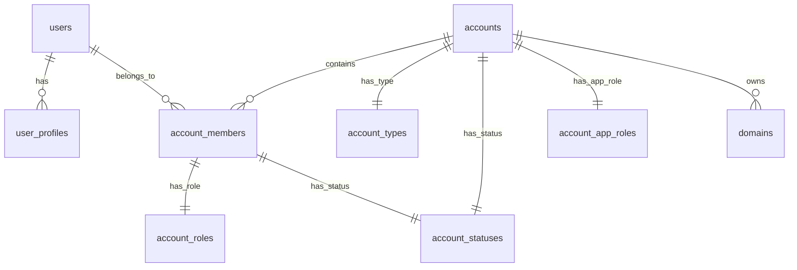

import { Accordion, Accordions } from "fumadocs-ui/components/accordion";
import Link from "next/link";

<Accordions type="single">
  <Accordion title="Series navigation">
    <ul>
      <li>
        <Link href="/blog/multitenant-supabase-part-1">Part 1: Project Setup & Cross-Domain cookies</Link>
      </li>
      <li>
        <Link href="/blog/multitenant-supabase-part-2">Part 2: Database schema setup</Link>
      </li>
      <li>
        <Link href="/blog/multitenant-supabase-part-3">Part 3: Auth claims and permissions</Link>
      </li>
      <li>
        Part 4: Enhanced subdomain routing and multi-tenant middleware
      </li>
      <li>
        Part 5: User and organization settings
      </li>
    </ul>
  </Accordion>
  <Accordion title="Series description">
    In this series, we're building a multi-tenant organization system using Supabase and Next.js. Functionality includes:

    - Supabase authentication
    - Organization management
    - User invitations
    - Organization-wide permissions
    - Cross-domain authentication cookies
    - UI components for authentication, organization management, and more

  </Accordion>
</Accordions>

## Introduction

In the [previous part](/blog/multitenant-supabase-part-1), we set up our multi-tenant Supabase project with cross-domain authentication. Now we'll create the database schema that powers our multi-tenant organization system.

## A users view

- **One user account** with consistent identity across all workspaces (1 email, multiple accounts)
- E.g. **Three organization memberships** with different roles:
  - Owner of `username` (personal workspace)
  - Member of `acme-corp-team` (company workspace)
  - Admin of `design-collective` (company workspace)

User can seamlessly switch between these contexts without logging out, and each organization has complete data isolation.

## Setting Up Your Supabase Schema

### Prerequisites

Before we start, ensure you have:

- A Supabase project created
- Database access (either via dashboard or local development)
- Understanding of (Supabase built-in `auth.users` table)[https://supabase.com/docs/guides/auth/users]

### Migration Strategy

We'll run these migrations in order, building on Supabase's existing auth system:

```sql
-- 1. Initial setup (extensions, schemas, permissions)
-- 2. User profiles
-- 3. Organizations and membership system
-- 4. Invitation system with JWT integration
-- 5. Domain verification (optional)
-- 6. Auth hooks and claims (part 3)
```

### Step 1: Initial Setup

Create the foundation by extending Supabase's auth system with an `accounts` schema:

```sql
-- Create additional schemas
CREATE SCHEMA IF NOT EXISTS accounts;

-- Set up permissions for Supabase roles
GRANT USAGE ON SCHEMA accounts TO authenticated, service_role, supabase_auth_admin;
GRANT ALL ON ALL TABLES IN SCHEMA accounts TO service_role, supabase_auth_admin;

-- Store secrets in Supabase Vault for invitation tokens
SELECT vault.create_secret(
  'your-super-secret-invitation-key-here',
  'invitation_secret',
  'Secret used to sign invitation tokens'
);
```

### Step 2: Extend Supabase Auth with Profiles

```sql
-- Email status enum
CREATE TYPE public.email_status AS ENUM ('pending', 'confirmed');

-- User profiles extending auth.users
CREATE TABLE public.user_profiles(
  id uuid PRIMARY KEY REFERENCES auth.users(id) ON DELETE CASCADE,
  username text NOT NULL UNIQUE,
  full_name text,
  email text NOT NULL UNIQUE,
  email_status public.email_status DEFAULT 'pending',
  settings jsonb DEFAULT '{}',
  onboarding_completed boolean DEFAULT FALSE,
  updated_at timestamp with time zone DEFAULT now(),
  created_at timestamp with time zone DEFAULT now()
);

-- Enable RLS immediately
ALTER TABLE public.user_profiles ENABLE ROW LEVEL SECURITY;

-- Basic RLS policy
CREATE POLICY "Users can view own profile" ON public.user_profiles
  FOR SELECT USING ((select auth.uid()) = id);
```

### Step 3: Create the Multi-Tenant Foundation

```sql
-- Account types and roles
CREATE TABLE accounts.account_types(
  id uuid PRIMARY KEY DEFAULT gen_random_uuid(),
  name text NOT NULL,
  slug text NOT NULL UNIQUE,
  description text
);

CREATE TABLE accounts.account_roles(
  id uuid PRIMARY KEY DEFAULT gen_random_uuid(),
  name text NOT NULL,
  slug text NOT NULL UNIQUE,
  description text
);

-- Account-level app roles (what kind of account this is in the broader app)
CREATE TABLE accounts.account_app_roles(
  id uuid PRIMARY KEY DEFAULT gen_random_uuid(),
  name text NOT NULL,
  slug text NOT NULL UNIQUE,
  description text,
  permissions jsonb DEFAULT '[]'
);

-- Insert essential data
INSERT INTO accounts.account_types (name, slug, description) VALUES
  ('Personal', 'personal', 'Individual workspace'),
  ('Team', 'team', 'Collaborative workspace');

INSERT INTO accounts.account_roles (name, slug, description) VALUES
  ('Owner', 'owner', 'Full access to account'),
  ('Admin', 'admin', 'Manage members and settings'),
  ('Member', 'member', 'Standard member access'),
  ('Guest', 'guest', 'Read-only access');

-- Insert account app roles (extensible for different account purposes)
INSERT INTO accounts.account_app_roles (name, slug, description, permissions) VALUES
  ('Admin', 'admin', 'Internal admin accounts with elevated privileges', '["app:admin", "app:manage_users", "app:system_config"]'),
  ('Client', 'client', 'Standard client accounts', '["app:standard_access"]'),
  ('Partner', 'partner', 'Business partner accounts', '["app:partner_access", "app:api_access"]');
```

This allows for:

- **Personal accounts** - Individual user workspaces (automatically created)
- **Team accounts** - Collaborative workspaces (created by users)

**Real-world examples:**

- **Admin accounts** - Internal staff accounts with system-wide privileges
- **Client accounts** - Customer accounts with standard access (default for new users)
- **Partner accounts** - Business partner accounts with API access and special permissions
- **Vendor accounts** - Supplier accounts with limited but specific access patterns

This system is **completely extensible** - you can add new app roles like `enterprise`, `reseller`, `integration`, etc., each with their own permission sets and business logic.

Let's explore each component in detail.

### Database Schema Diagram

Here's how all the tables relate to each other:



This diagram shows the core relationships in our multi-tenant system. Notice how `account_members` is the central table that connects users to accounts with specific roles, and how accounts have both a type (personal/team) and an app-level role that determines their purpose in the broader application.

### Account Statuses

```sql
CREATE TABLE accounts.account_statuses(
  id uuid PRIMARY KEY DEFAULT uuid_generate_v4(),
  name text NOT NULL,
  slug text NOT NULL UNIQUE CHECK (slug IN (
    'active', 'suspended', 'deleted', 'pending', 'inactive'
  )),
  description text
);

-- Insert essential statuses
INSERT INTO accounts.account_statuses (name, slug, description) VALUES
  ('Active', 'active', 'Account is active and functional'),
  ('Suspended', 'suspended', 'Account is temporarily suspended'),
  ('Deleted', 'deleted', 'Account is marked for deletion'),
  ('Pending', 'pending', 'Account is pending activation'),
  ('Inactive', 'inactive', 'Account is inactive');
```

### Main Accounts Table

```sql
CREATE TABLE accounts.accounts(
  id uuid PRIMARY KEY DEFAULT uuid_generate_v4(),
  owner_id uuid REFERENCES auth.users(id),
  name text NOT NULL CHECK (length(name) >= 2 AND length(name) <= 128),
  slug text UNIQUE NOT NULL CHECK (length(slug) >= 3 AND length(slug) <= 128),
  status uuid REFERENCES accounts.account_statuses(id),
  billing_email text,
  billing_customer_id text,
  type uuid REFERENCES accounts.account_types(id),
  app_role uuid REFERENCES accounts.account_app_roles(id),
  settings jsonb DEFAULT '{}',
  deleted_at timestamp with time zone,
  updated_at timestamp with time zone DEFAULT now(),
  created_at timestamp with time zone DEFAULT now()
);
```

### Account Members

The core membership table that connects users to accounts:

```sql
CREATE TABLE accounts.account_members(
  id uuid PRIMARY KEY DEFAULT uuid_generate_v4(),
  user_id uuid REFERENCES auth.users(id) ON DELETE CASCADE,
  account_id uuid REFERENCES accounts.accounts(id) ON DELETE CASCADE,
  membership_status uuid REFERENCES accounts.account_statuses(id),
  role_id uuid REFERENCES accounts.account_roles(id),

  -- Invitation fields
  invite_token text UNIQUE,
  invite_expires_at timestamp with time zone,
  invite_email text,
  invited_by_id uuid REFERENCES auth.users(id),
  invite_payload jsonb DEFAULT '{}',

  -- User preferences for this account
  settings jsonb DEFAULT '{}',

  updated_at timestamp with time zone DEFAULT now(),
  created_at timestamp with time zone DEFAULT now(),

  -- Ensure unique membership per user per account
  UNIQUE (account_id, user_id),
  UNIQUE (account_id, invite_email)
);
```

### Invitation System

### Secure Token Generation

We use JWT tokens for secure invitations:

```sql
CREATE OR REPLACE FUNCTION accounts.set_invite_token(
  role_name text,
  account_id uuid,
  invite_expires_at timestamp with time zone,
  invite_email text,
  invited_by_id uuid
) RETURNS text AS $$
DECLARE
  claims jsonb;
  token text;
  secret text;
BEGIN
  -- Validate role
  IF role_name NOT IN ('owner', 'admin', 'member', 'guest') THEN
    RAISE EXCEPTION 'Invalid role_name: %', role_name;
  END IF;

  -- Check if user is already a member
  IF EXISTS (
    SELECT 1 FROM accounts.account_members
    WHERE account_id = set_invite_token.account_id
    AND user_id = (SELECT id FROM auth.users WHERE email = invite_email)
  ) THEN
    RAISE EXCEPTION 'User is already a member of this account';
  END IF;

  -- Get signing secret
  SELECT decrypted_secret INTO secret
  FROM vault.decrypted_secrets
  WHERE name = 'invitation_secret';

  -- Set expiration if not provided
  IF invite_expires_at IS NULL THEN
    invite_expires_at := now() + interval '1 week';
  END IF;

  -- Build JWT claims
  claims := jsonb_build_object(
    'role_name', role_name,
    'account_id', account_id,
    'invite_email', invite_email,
    'invited_by_id', invited_by_id,
    'exp', invite_expires_at
  );

  -- Generate signed token
  token := extensions.sign(claims::json, secret, 'HS256');

  RETURN token;
END;
$$ LANGUAGE plpgsql SECURITY DEFINER;
```

### Invitation Workflow

1. **Create Invitation**: Account owner/admin creates invitation
2. **Generate Token**: Secure JWT token generated with expiration
3. **Send Email**: Token sent to invitee via email
4. **Accept Invitation**: User signs up/logs in with token
5. **Automatic Membership**: Trigger updates membership when user confirms email

```sql
-- Trigger to handle accepted invitations
CREATE OR REPLACE FUNCTION accounts.handle_user_confirmed_email()
RETURNS TRIGGER AS $$
BEGIN
  IF NEW.confirmed_at IS NOT NULL THEN
    -- Update user profile
    UPDATE public.user_profiles
    SET email_status = 'confirmed'
    WHERE id = NEW.id;

    -- Activate pending memberships
    UPDATE accounts.account_members
    SET membership_status = (
      SELECT id FROM accounts.account_statuses WHERE slug = 'active'
    )
    WHERE user_id = NEW.id
    AND membership_status = (
      SELECT id FROM accounts.account_statuses WHERE slug = 'pending'
    );
  END IF;
  RETURN NEW;
END;
$$ LANGUAGE plpgsql SECURITY DEFINER;

-- Create the trigger
CREATE TRIGGER on_auth_user_confirmed
  AFTER UPDATE ON auth.users
  FOR EACH ROW EXECUTE FUNCTION accounts.handle_user_confirmed_email();
```

## 6. Automatic User Onboarding

### New User Trigger

When a user signs up, we automatically create their profile and personal account:

```sql
CREATE OR REPLACE FUNCTION accounts.handle_new_user()
RETURNS TRIGGER AS $$
DECLARE
  personal_account_id uuid;
  username text;
  unique_username text;
BEGIN
  -- Extract username from metadata or email
  username := COALESCE(NEW.raw_user_meta_data->>'username', split_part(NEW.email, '@', 1));

  -- Generate unique username
  unique_username := username;
  WHILE EXISTS (SELECT 1 FROM public.user_profiles WHERE username = unique_username) LOOP
    unique_username := username || '_' || substr(gen_random_uuid()::text, 1, 4);
  END LOOP;

  -- Create user profile
  INSERT INTO public.user_profiles (id, email, username, email_status)
  VALUES (
    NEW.id,
    NEW.email,
    unique_username,
    CASE WHEN NEW.email_confirmed_at IS NULL THEN 'pending' ELSE 'confirmed' END
  );

  -- Create personal account
  INSERT INTO accounts.accounts (name, owner_id, type, slug, status)
  SELECT
    unique_username,
    NEW.id,
    act.id,
    unique_username,
    acs.id
  FROM accounts.account_types act, accounts.account_statuses acs
  WHERE act.slug = 'personal' AND acs.slug = 'active'
  RETURNING id INTO personal_account_id;

  -- Add owner membership
  INSERT INTO accounts.account_members (account_id, user_id, role_id, membership_status)
  SELECT personal_account_id, NEW.id, ar.id, acs.id
  FROM accounts.account_roles ar, accounts.account_statuses acs
  WHERE ar.slug = 'owner' AND acs.slug = 'active';

  RETURN NEW;
END;
$$ LANGUAGE plpgsql SECURITY DEFINER;

-- Create the trigger
CREATE TRIGGER on_auth_user_created
  AFTER INSERT ON auth.users
  FOR EACH ROW EXECUTE FUNCTION accounts.handle_new_user();
```

## 7. Performance Optimization

### Essential Database Indexes

Add these indexes for optimal multi-tenant query performance:

```sql
-- User lookup optimizations
CREATE INDEX CONCURRENTLY idx_user_profiles_email ON public.user_profiles(email);
CREATE INDEX CONCURRENTLY idx_user_profiles_username ON public.user_profiles(username);

-- Multi-tenant query optimizations
CREATE INDEX CONCURRENTLY idx_account_members_user_account ON accounts.account_members(user_id, account_id);
CREATE INDEX CONCURRENTLY idx_account_members_account_role ON accounts.account_members(account_id, role_id);
CREATE INDEX CONCURRENTLY idx_accounts_owner_status ON accounts.accounts(owner_id, status);

-- Invitation system optimizations
CREATE INDEX CONCURRENTLY idx_account_members_invite_token
ON accounts.account_members(invite_token) WHERE invite_token IS NOT NULL;
CREATE INDEX CONCURRENTLY idx_account_members_invite_expires
ON accounts.account_members(invite_expires_at) WHERE invite_expires_at IS NOT NULL;

-- Domain verification optimization
CREATE INDEX CONCURRENTLY idx_domains_account_name ON public.domains(account_id, name);
```

### Data Cleanup Functions

Implement regular maintenance procedures:

```sql
-- Clean up expired invitations
CREATE OR REPLACE FUNCTION accounts.cleanup_expired_invitations()
RETURNS void AS $$
BEGIN
  DELETE FROM accounts.account_members
  WHERE user_id IS NULL
  AND invite_expires_at < NOW() - INTERVAL '7 days';
END;
$$ LANGUAGE plpgsql SECURITY DEFINER;

-- Archive soft-deleted accounts
CREATE OR REPLACE FUNCTION accounts.archive_deleted_accounts()
RETURNS void AS $$
BEGIN
  UPDATE accounts.accounts
  SET deleted_at = NOW()
  WHERE status = (SELECT id FROM accounts.account_statuses WHERE slug = 'deleted')
  AND deleted_at IS NULL;
END;
$$ LANGUAGE plpgsql SECURITY DEFINER;
```

## Database Schema Complete

### What We've Built

Our multi-tenant database schema now includes:

✅ **User Management**: Clean profiles extending Supabase auth
✅ **Organization System**: Simple personal and team account types
✅ **Account App Roles**: Extensible system for admin, client, partner accounts
✅ **Membership Management**: Role-based access within each account
✅ **Invitation System**: JWT-based invitations with automatic onboarding
✅ **Performance Optimization**: Proper indexing and cleanup procedures

### Supabase Integration Highlights

This schema leverages Supabase's strengths:

- **Extends `auth.users`** rather than replacing it
- **Uses Vault secrets** for secure invitation token signing
- **Triggers for automation** on user signup and email confirmation
- **Ready for auth hooks** to inject multi-tenant context into JWTs

### Implementation Checklist

**✅ Run these migrations in order:**

1. **Initial setup**: Schemas, permissions, and Vault secrets
2. **User system**: Profiles and settings
3. **Account system**: Organizations, types, and statuses
4. **Membership system**: User-account relationships
5. **Invitation system**: Secure token-based invitations
6. **Domain verification**: Organization domain ownership
7. **Automation**: User onboarding triggers
8. **Performance**: Indexes and cleanup functions

## Next: Auth Claims and Permissions

In [**Part 3**](/blog/multitenant-supabase-part-3), we'll implement the authorization layer:

- **Auth Hooks**: Custom JWT claims with account context
- **Permission System**: Organization-level authorization checks
- **Row Level Security**: Database-level access control
- **Domain verification**: Organization domain ownership
- **Testing Strategies**: Ensuring tenant isolation and security
- **Common Pitfalls**: Avoiding multi-tenant data leakage

The database foundation is now complete. Next, we'll add the authorization system that makes our multi-tenant architecture secure and functional.
