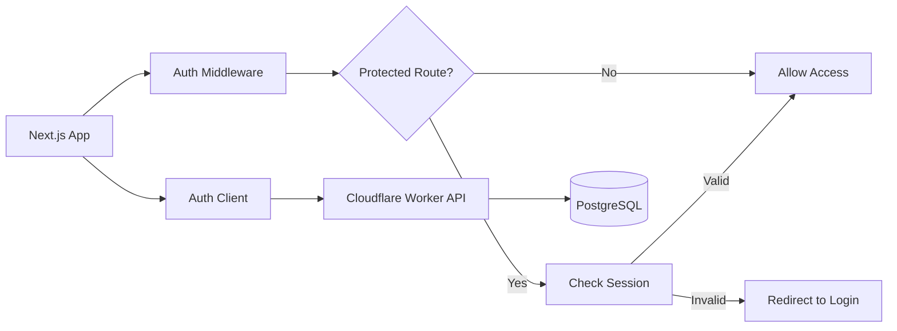

import { Tabs, Tab } from "fumadocs-ui/components/tabs";
import { Steps, Step } from "fumadocs-ui/components/steps";
import { Callout } from "fumadocs-ui/components/callout";
import { Cards, Card } from "fumadocs-ui/components/card";

<Callout title="Prerequisites" type="info">
  This guide assumes you have already deployed the [Hono authentication
  server](/docs/snippets/cloudflare-better-auth/installation) to Cloudflare
  Workers.
</Callout>

## Overview

This snippet provides a complete Next.js client implementation for the Cloudflare Workers authentication API. It includes:

- 🔐 **Full authentication flow** - Sign up, sign in, password reset, email verification
- 🛡️ **Route protection** - Middleware-based authentication guards
- 🍪 **Cookie management** - Secure cross-domain cookie handling
- ⚡ **Edge runtime ready** - Optimized for Next.js edge runtime
- 🎯 **Type-safe** - Full TypeScript support with Better Auth types
- 🔄 **Session management** - Client and server-side session handling

### Architecture



## Installation

<Tabs items={["CLI", "Manual"]}>
  <Tab value="CLI">
    ```bash
    npx shadcn@latest add https://snippets.thedevdavid.com/r/hono-cloudflare-better-auth-client-nextjs.json
    ```

    This will:
    1. Install Better Auth client dependencies
    2. Create authentication utilities
    3. Set up middleware for route protection
    4. Add environment variable template

  </Tab>

  <Tab value="Manual">
    1. Install dependencies:
    ```bash
    npm install better-auth @better-auth/client
    ```

    2. Copy all files from the registry
    3. Update import paths as needed

  </Tab>
</Tabs>

## Configuration

### 1. Environment Variables

Create `.env.local`:

```bash title=".env.local"
# Your Cloudflare Worker URL
NEXT_PUBLIC_API_URL=https://auth.yourdomain.com

# Or for development
NEXT_PUBLIC_API_URL=http://localhost:8787
```

### 2. Update Authentication Client

The auth client is pre-configured, but you can customize it:

```ts title="lib/auth-client.ts"
import { createAuthClient } from "better-auth/client";
import { nextCookies } from "better-auth/next-js";

export const authClient = createAuthClient({
  baseURL: process.env.NEXT_PUBLIC_API_URL!,

  plugins: [
    nextCookies(), // Next.js cookie handling
  ],

  // Advanced options
  fetchOptions: {
    credentials: "include", // Include cookies
    headers: {
      "Content-Type": "application/json",
    },
  },

  // Session configuration
  session: {
    cookieCache: {
      enabled: true,
      maxAge: 5 * 60, // 5 minutes
    },
  },
});

// Export typed hooks
export const {
  signIn,
  signUp,
  signOut,
  useSession,
  forgotPassword,
  resetPassword,
  verifyEmail,
  changeEmail,
  changePassword,
} = authClient;
```

### 3. Configure Middleware

Update protected routes in `middleware.ts`:

```ts title="middleware.ts"
import { authMiddleware } from "@/lib/auth-middleware";

export default authMiddleware({
  // Add your protected routes
  protectedRoutes: ["/dashboard", "/settings", "/admin", "/api/protected"],

  // Redirect URL for unauthenticated users
  redirectTo: "/login",

  // Optional: Custom logic
  beforeAuth: async (request) => {
    // Add custom headers, logging, etc.
  },

  afterAuth: async (request, session) => {
    // Access control based on user roles
    if (request.nextUrl.pathname.startsWith("/admin")) {
      if (!session?.user || session.user.role !== "admin") {
        return new Response("Forbidden", { status: 403 });
      }
    }
  },
});

export const config = {
  matcher: ["/((?!_next/static|_next/image|favicon.ico|public).*)"],
};
```

## Usage Examples

### Authentication Components

<Tabs items={["Sign Up", "Sign In", "Password Reset"]}>
  <Tab value="Sign Up">
    ```tsx title="app/auth/signup/page.tsx"
    "use client";

    import { useState } from "react";
    import { useRouter } from "next/navigation";
    import { signUp } from "@/lib/auth-client";
    import { Button } from "@/components/ui/button";
    import { Input } from "@/components/ui/input";
    import { Label } from "@/components/ui/label";
    import { Alert } from "@/components/ui/alert";

    export default function SignUpPage() {
      const [error, setError] = useState("");
      const [loading, setLoading] = useState(false);
      const router = useRouter();

      async function handleSubmit(e: React.FormEvent<HTMLFormElement>) {
        e.preventDefault();
        setError("");
        setLoading(true);

        const formData = new FormData(e.currentTarget);

        try {
          await signUp.email({
            email: formData.get("email") as string,
            password: formData.get("password") as string,
            name: formData.get("name") as string,
          });

          router.push("/auth/verify-email");
        } catch (err) {
          setError(err.message || "Failed to create account");
        } finally {
          setLoading(false);
        }
      }

      return (
        <form onSubmit={handleSubmit} className="space-y-4 max-w-md mx-auto">
          <div>
            <Label htmlFor="name">Name</Label>
            <Input
              id="name"
              name="name"
              type="text"
              required
              autoComplete="name"
            />
          </div>

          <div>
            <Label htmlFor="email">Email</Label>
            <Input
              id="email"
              name="email"
              type="email"
              required
              autoComplete="email"
            />
          </div>

          <div>
            <Label htmlFor="password">Password</Label>
            <Input
              id="password"
              name="password"
              type="password"
              required
              autoComplete="new-password"
              minLength={8}
            />
          </div>

          {error && (
            <Alert variant="destructive">
              {error}
            </Alert>
          )}

          <Button type="submit" disabled={loading} className="w-full">
            {loading ? "Creating account..." : "Sign Up"}
          </Button>
        </form>
      );
    }
    ```

  </Tab>

  <Tab value="Sign In">
    ```tsx title="app/auth/signin/page.tsx"
    "use client";

    import { useState } from "react";
    import { useRouter } from "next/navigation";
    import { signIn } from "@/lib/auth-client";

    export default function SignInPage() {
      const [error, setError] = useState("");
      const [loading, setLoading] = useState(false);
      const router = useRouter();

      async function handleSubmit(e: React.FormEvent<HTMLFormElement>) {
        e.preventDefault();
        setError("");
        setLoading(true);

        const formData = new FormData(e.currentTarget);

        try {
          await signIn.email({
            email: formData.get("email") as string,
            password: formData.get("password") as string,
          });

          router.push("/dashboard");
        } catch (err) {
          setError(err.message || "Invalid credentials");
        } finally {
          setLoading(false);
        }
      }

      return (
        <form onSubmit={handleSubmit} className="space-y-4 max-w-md mx-auto">
          <div>
            <Label htmlFor="email">Email</Label>
            <Input
              id="email"
              name="email"
              type="email"
              required
              autoComplete="email"
            />
          </div>

          <div>
            <Label htmlFor="password">Password</Label>
            <Input
              id="password"
              name="password"
              type="password"
              required
              autoComplete="current-password"
            />
          </div>

          <div className="flex items-center justify-between">
            <Link href="/auth/forgot-password" className="text-sm">
              Forgot password?
            </Link>
          </div>

          {error && (
            <Alert variant="destructive">
              {error}
            </Alert>
          )}

          <Button type="submit" disabled={loading} className="w-full">
            {loading ? "Signing in..." : "Sign In"}
          </Button>

          <p className="text-center text-sm">
            Don't have an account?{" "}
            <Link href="/auth/signup" className="font-medium">
              Sign up
            </Link>
          </p>
        </form>
      );
    }
    ```

  </Tab>

  <Tab value="Password Reset">
    ```tsx title="app/auth/reset-password/page.tsx"
    "use client";

    import { useState } from "react";
    import { useRouter, useSearchParams } from "next/navigation";
    import { resetPassword } from "@/lib/auth-client";

    export default function ResetPasswordPage() {
      const [error, setError] = useState("");
      const [loading, setLoading] = useState(false);
      const router = useRouter();
      const searchParams = useSearchParams();
      const token = searchParams.get("token");

      if (!token) {
        return (
          <Alert variant="destructive">
            Invalid or missing reset token
          </Alert>
        );
      }

      async function handleSubmit(e: React.FormEvent<HTMLFormElement>) {
        e.preventDefault();
        setError("");
        setLoading(true);

        const formData = new FormData(e.currentTarget);
        const password = formData.get("password") as string;
        const confirmPassword = formData.get("confirmPassword") as string;

        if (password !== confirmPassword) {
          setError("Passwords do not match");
          setLoading(false);
          return;
        }

        try {
          await resetPassword({
            token,
            password,
          });

          router.push("/auth/signin?reset=success");
        } catch (err) {
          setError(err.message || "Failed to reset password");
        } finally {
          setLoading(false);
        }
      }

      return (
        <form onSubmit={handleSubmit} className="space-y-4 max-w-md mx-auto">
          <div>
            <Label htmlFor="password">New Password</Label>
            <Input
              id="password"
              name="password"
              type="password"
              required
              minLength={8}
            />
          </div>

          <div>
            <Label htmlFor="confirmPassword">Confirm Password</Label>
            <Input
              id="confirmPassword"
              name="confirmPassword"
              type="password"
              required
              minLength={8}
            />
          </div>

          {error && (
            <Alert variant="destructive">
              {error}
            </Alert>
          )}

          <Button type="submit" disabled={loading} className="w-full">
            {loading ? "Resetting..." : "Reset Password"}
          </Button>
        </form>
      );
    }
    ```

  </Tab>
</Tabs>

### Using Sessions

<Tabs items={["Client Component", "Server Component", "Server Action"]}>
  <Tab value="Client Component">
    ```tsx title="components/user-menu.tsx"
    "use client";

    import { useSession, signOut } from "@/lib/auth-client";
    import { useRouter } from "next/navigation";

    export function UserMenu() {
      const { data: session, loading } = useSession();
      const router = useRouter();

      if (loading) {
        return <div>Loading...</div>;
      }

      if (!session) {
        return null;
      }

      async function handleSignOut() {
        await signOut();
        router.push("/");
      }

      return (
        <div className="flex items-center gap-4">
          <span>{session.user.email}</span>
          <Button onClick={handleSignOut} variant="outline">
            Sign Out
          </Button>
        </div>
      );
    }
    ```

  </Tab>

  <Tab value="Server Component">
    ```tsx title="app/dashboard/page.tsx"
    import { getBetterAuthSession } from "@/lib/get-session";
    import { redirect } from "next/navigation";

    export default async function DashboardPage() {
      const session = await getBetterAuthSession();

      if (!session) {
        redirect("/auth/signin");
      }

      return (
        <div>
          <h1>Welcome, {session.user.name || session.user.email}!</h1>
          <p>User ID: {session.user.id}</p>
          <p>Role: {session.user.role}</p>
          <p>Email verified: {session.user.emailVerified ? "Yes" : "No"}</p>
        </div>
      );
    }
    ```

  </Tab>

  <Tab value="Server Action">
    ```tsx title="app/actions.ts"
    "use server";

    import { getBetterAuthSession } from "@/lib/get-session";
    import { revalidatePath } from "next/cache";

    export async function updateProfile(formData: FormData) {
      const session = await getBetterAuthSession();

      if (!session) {
        throw new Error("Unauthorized");
      }

      const response = await fetch(`${process.env.NEXT_PUBLIC_API_URL}/api/user/profile`, {
        method: "PATCH",
        headers: {
          "Content-Type": "application/json",
          "Cookie": `better-auth.session_token=${session.sessionToken}`,
        },
        body: JSON.stringify({
          name: formData.get("name"),
          bio: formData.get("bio"),
        }),
      });

      if (!response.ok) {
        throw new Error("Failed to update profile");
      }

      revalidatePath("/dashboard");
    }
    ```

  </Tab>
</Tabs>

### Protected API Routes

```ts title="app/api/protected/route.ts"
import { getBetterAuthSession } from "@/lib/get-session";
import { NextResponse } from "next/server";

export async function GET() {
  const session = await getBetterAuthSession();

  if (!session) {
    return NextResponse.json({ error: "Unauthorized" }, { status: 401 });
  }

  // Your protected logic here
  return NextResponse.json({
    message: "This is protected data",
    userId: session.user.id,
  });
}
```

## Advanced Features

### CAPTCHA Integration

Add Cloudflare Turnstile to your forms:

```tsx title="components/turnstile.tsx"
"use client";

import { useEffect, useRef } from "react";

interface TurnstileProps {
  siteKey: string;
  onVerify: (token: string) => void;
}

export function Turnstile({ siteKey, onVerify }: TurnstileProps) {
  const ref = useRef<HTMLDivElement>(null);

  useEffect(() => {
    if (!ref.current) return;

    const script = document.createElement("script");
    script.src = "https://challenges.cloudflare.com/turnstile/v0/api.js";
    script.async = true;
    script.defer = true;
    document.body.appendChild(script);

    script.onload = () => {
      if (window.turnstile && ref.current) {
        window.turnstile.render(ref.current, {
          sitekey: siteKey,
          callback: onVerify,
        });
      }
    };

    return () => {
      document.body.removeChild(script);
    };
  }, [siteKey, onVerify]);

  return <div ref={ref} />;
}

// Usage in signup form
<Turnstile
  siteKey={process.env.NEXT_PUBLIC_TURNSTILE_SITE_KEY!}
  onVerify={(token) => setTurnstileToken(token)}
/>;
```

### Email Verification Flow

```tsx title="app/auth/verify-email/page.tsx"
"use client";

import { useEffect, useState } from "react";
import { useSearchParams } from "next/navigation";
import { verifyEmail } from "@/lib/auth-client";

export default function VerifyEmailPage() {
  const [status, setStatus] = useState<"loading" | "success" | "error">(
    "loading"
  );
  const searchParams = useSearchParams();
  const token = searchParams.get("token");

  useEffect(() => {
    if (!token) {
      setStatus("error");
      return;
    }

    verifyEmail({ token })
      .then(() => setStatus("success"))
      .catch(() => setStatus("error"));
  }, [token]);

  if (!token) {
    return (
      <div className="text-center">
        <h1>Check your email</h1>
        <p>We've sent you a verification link.</p>
      </div>
    );
  }

  return (
    <div className="text-center">
      {status === "loading" && <p>Verifying your email...</p>}
      {status === "success" && (
        <>
          <h1>Email verified!</h1>
          <Link href="/dashboard">Go to Dashboard</Link>
        </>
      )}
      {status === "error" && (
        <>
          <h1>Verification failed</h1>
          <p>The link may be expired or invalid.</p>
        </>
      )}
    </div>
  );
}
```

### Role-Based Access Control

```tsx title="components/admin-guard.tsx"
"use client";

import { useSession } from "@/lib/auth-client";
import { useRouter } from "next/navigation";
import { useEffect } from "react";

interface AdminGuardProps {
  children: React.ReactNode;
  fallback?: React.ReactNode;
}

export function AdminGuard({ children, fallback }: AdminGuardProps) {
  const { data: session, loading } = useSession();
  const router = useRouter();

  useEffect(() => {
    if (!loading && (!session || session.user.role !== "admin")) {
      router.push("/");
    }
  }, [session, loading, router]);

  if (loading) {
    return <>{fallback || <div>Loading...</div>}</>;
  }

  if (!session || session.user.role !== "admin") {
    return null;
  }

  return <>{children}</>;
}

// Usage
<AdminGuard>
  <AdminDashboard />
</AdminGuard>;
```

### Custom Hooks

```tsx title="hooks/use-auth.ts"
import { useSession, signOut } from "@/lib/auth-client";
import { useRouter } from "next/navigation";
import { useCallback } from "react";

export function useAuth() {
  const session = useSession();
  const router = useRouter();

  const logout = useCallback(async () => {
    await signOut();
    router.push("/");
  }, [router]);

  const requireAuth = useCallback(() => {
    if (!session.data) {
      router.push("/auth/signin");
      return false;
    }
    return true;
  }, [session.data, router]);

  const requireRole = useCallback(
    (role: string) => {
      if (!session.data || session.data.user.role !== role) {
        router.push("/");
        return false;
      }
      return true;
    },
    [session.data, router]
  );

  return {
    user: session.data?.user,
    session: session.data,
    loading: session.loading,
    error: session.error,
    logout,
    requireAuth,
    requireRole,
  };
}
```

## Performance Optimization

### Static Generation with Auth

```tsx title="app/profile/[id]/page.tsx"
import { getBetterAuthSession } from "@/lib/get-session";
import { notFound } from "next/navigation";

// Generate static params for public profiles
export async function generateStaticParams() {
  const response = await fetch(
    `${process.env.NEXT_PUBLIC_API_URL}/api/public/users`
  );
  const users = await response.json();

  return users.map((user) => ({
    id: user.id,
  }));
}

export default async function ProfilePage({
  params,
}: {
  params: { id: string };
}) {
  const session = await getBetterAuthSession();
  const isOwnProfile = session?.user.id === params.id;

  const response = await fetch(
    `${process.env.NEXT_PUBLIC_API_URL}/api/users/${params.id}`,
    {
      headers: session
        ? {
            Cookie: `better-auth.session_token=${session.sessionToken}`,
          }
        : {},
    }
  );

  if (!response.ok) {
    notFound();
  }

  const profile = await response.json();

  return (
    <div>
      <h1>{profile.name}</h1>
      {isOwnProfile && <Link href="/settings">Edit Profile</Link>}
    </div>
  );
}
```

### Prefetching User Data

```tsx title="app/layout.tsx"
import { getBetterAuthSession } from "@/lib/get-session";

export default async function RootLayout({
  children,
}: {
  children: React.ReactNode;
}) {
  const session = await getBetterAuthSession();

  return (
    <html lang="en">
      <body>
        <nav>
          {session ? (
            <UserMenu initialSession={session} />
          ) : (
            <Link href="/auth/signin">Sign In</Link>
          )}
        </nav>
        {children}
      </body>
    </html>
  );
}
```

## Security Considerations

<Callout type="warning" title="Security Best Practices">
  1. Always validate sessions server-side for sensitive operations 2. Use HTTPS
  in production for secure cookie transmission 3. Implement CSRF protection for
  state-changing operations 4. Add rate limiting to prevent brute force attacks
  5. Enable email verification for new accounts 6. Use strong password
  requirements
</Callout>

### CSRF Protection

```tsx title="lib/csrf.ts"
import { getBetterAuthSession } from "@/lib/get-session";

export async function validateCSRF(request: Request) {
  const session = await getBetterAuthSession();

  if (!session) {
    throw new Error("Unauthorized");
  }

  const origin = request.headers.get("origin");
  const allowedOrigins = [
    process.env.NEXT_PUBLIC_APP_URL,
    "https://yourdomain.com",
  ];

  if (!origin || !allowedOrigins.includes(origin)) {
    throw new Error("CSRF validation failed");
  }

  return session;
}
```

## Troubleshooting

### Common Issues

<Steps>
  <Step>
    ### CORS Errors

    Ensure your Cloudflare Worker has proper CORS configuration:
    - Add your Next.js app URL to `CORS_ORIGINS`
    - Include credentials in fetch options
    - Check preflight request handling

  </Step>

  <Step>
    ### Session Not Persisting

    Check these settings:
    - Cookie domain configuration
    - SameSite and Secure attributes
    - Middleware matcher configuration

  </Step>

  <Step>
    ### TypeScript Errors

    Generate Better Auth types:
    ```bash
    npx better-auth generate
    ```

  </Step>
</Steps>

## Migration Guide

### From NextAuth.js

```tsx title="Migration mapping"
// NextAuth.js
import { useSession } from "next-auth/react";
const { data: session } = useSession();

// Better Auth
import { useSession } from "@/lib/auth-client";
const { data: session } = useSession();

// NextAuth.js
import { getServerSession } from "next-auth";
const session = await getServerSession();

// Better Auth
import { getBetterAuthSession } from "@/lib/get-session";
const session = await getBetterAuthSession();
```

## Next Steps

<Cards>
  <Card
    title="OAuth Integration"
    href="/docs/snippets/cloudflare-better-auth/oauth"
    description="Add social login providers"
  />
  <Card
    title="Two-Factor Auth"
    href="/docs/snippets/cloudflare-better-auth/2fa"
    description="Enhance security with 2FA"
  />
  <Card
    title="Production Checklist"
    href="/docs/snippets/cloudflare-better-auth/production"
    description="Deploy to production"
  />
</Cards>
