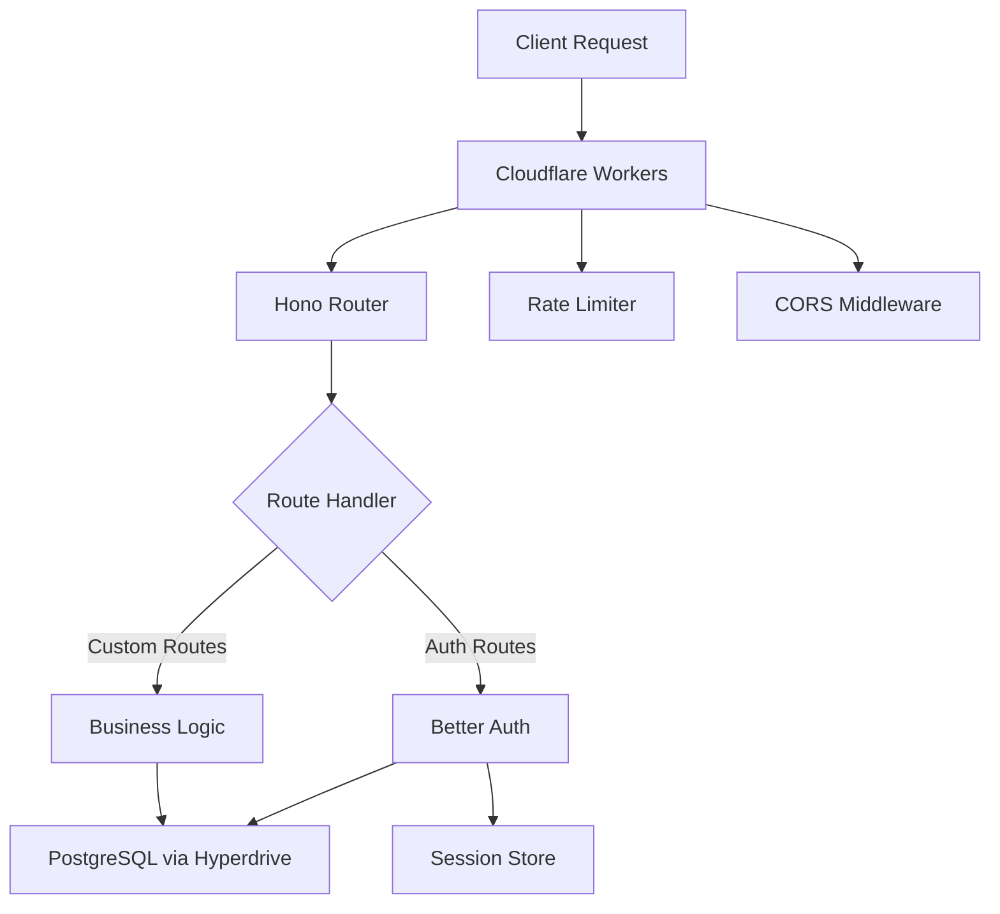

import { Tabs, Tab } from "fumadocs-ui/components/tabs";
import { Steps, Step } from "fumadocs-ui/components/steps";
import { Callout } from "fumadocs-ui/components/callout";
import { CodeBlock } from "fumadocs-ui/components/codeblock";

## Architecture Overview

The authentication server is built with a modular architecture optimized for edge deployment:



### Core Components

1. **Hono Framework** - Lightweight router optimized for edge
2. **Better Auth** - Comprehensive authentication library
3. **Hyperdrive** - Connection pooling for PostgreSQL
4. **Drizzle ORM** - Type-safe database queries
5. **Rate Limiting** - Built-in Cloudflare rate limiters
6. **Session Management** - Cookie-based with cache

## Implementation Details

### Entry Point Structure

The main entry point (`index.ts`) follows this pattern:

```ts title="Understanding index.ts"
import { Hono } from "hono";
import { cors } from "hono/cors";
import { Env } from "./lib/env";
import { createAuth } from "./lib/create-auth";
import { useAuth } from "./lib/use-auth";

const app = new Hono<{ Bindings: Env }>();

// 1. CORS middleware - must be first
app.use("*", cors({
  origin: (origin) => {
    const allowed = c.env.CORS_ORIGINS?.split(",") || [];
    return allowed.includes(origin) ? origin : allowed[0];
  },
  credentials: true,
}));

// 2. Auth instance creation per request
app.use("*", async (c, next) => {
  const auth = createAuth(c.env);
  c.set("auth", auth);
  await next();
});

// 3. Session middleware
app.use("*", useAuth());

// 4. Auth routes
app.on(["POST", "GET"], "/api/auth/*", async (c) => {
  const auth = c.get("auth");
  return auth.handler(c.req.raw);
});

// 5. Custom routes
app.get("/session", async (c) => {
  const user = c.get("user");
  const session = c.get("session");
  return c.json({ user, session });
});

export default app;
```

### Authentication Configuration

The `createAuth` function creates a Better Auth instance with proper configuration:

```ts title="lib/create-auth.ts"
import { betterAuth } from "better-auth";
import { drizzleAdapter } from "better-auth/adapters/drizzle";
import { admin } from "better-auth/plugins";

export function createAuth(env: Env) {
  const db = createDb(env);
  
  return betterAuth({
    database: drizzleAdapter(db, {
      provider: "pg",
      schema: authSchema,
    }),
    
    baseURL: env.BETTER_AUTH_URL,
    secret: env.BETTER_AUTH_SECRET,
    
    emailAndPassword: {
      enabled: true,
      requireEmailVerification: true,
      sendResetPassword: async ({ user, url }) => {
        // Email implementation
        await sendEmail(env, {
          to: user.email,
          subject: "Reset your password",
          html: `<a href="${url}">Reset Password</a>`,
        });
      },
    },
    
    plugins: [
      admin({
        impersonationSessionDuration: 60 * 60, // 1 hour
      }),
    ],
    
    session: {
      expiresIn: 60 * 60 * 24 * 90, // 90 days
      updateAfter: 60 * 60 * 24, // Update after 1 day
      cookieCache: {
        enabled: true,
        maxAge: 5 * 60, // 5 minutes
      },
    },
    
    account: {
      accountLinking: {
        enabled: true,
        trustedProviders: ["google", "github"],
      },
    },
    
    rateLimit: {
      window: 10 * 60, // 10 minutes
      max: 10, // 10 requests
      storage: "memory", // Use Cloudflare's rate limiter instead
    },
    
    advanced: {
      cookies: {
        domain: env.COOKIE_DOMAIN || undefined,
        sameSite: "lax",
        secure: env.BETTER_AUTH_URL?.startsWith("https"),
      },
    },
  });
}
```

### Database Connection

Hyperdrive provides connection pooling for PostgreSQL:

```ts title="lib/create-db.ts"
import { drizzle } from "drizzle-orm/postgres-js";
import postgres from "postgres";

export function createDb(env: Env) {
  const client = postgres(env.HYPERDRIVE.connectionString, {
    prepare: false, // Required for Hyperdrive
  });
  
  return drizzle(client, {
    schema: authSchema,
    logger: env.NODE_ENV === "development",
  });
}
```

### Session Middleware

The session middleware extracts and validates sessions:

```ts title="lib/use-auth.ts"
import { betterAuth } from "better-auth";
import type { Session, User } from "better-auth";

export function useAuth() {
  return async (c: Context, next: Next) => {
    const auth = c.get("auth");
    
    // Extract session from headers
    const sessionCookie = getCookie(c, "better-auth.session_token");
    
    if (!sessionCookie) {
      return next();
    }
    
    try {
      // Validate session
      const { user, session } = await auth.api.getSession({
        headers: c.req.headers,
      });
      
      if (user && session) {
        c.set("user", user);
        c.set("session", session);
      }
    } catch (error) {
      // Invalid session, continue without auth
      console.error("Session validation failed:", error);
    }
    
    return next();
  };
}
```

## Advanced Features

### Rate Limiting Implementation

Implement rate limiting with Cloudflare's native rate limiter:

```ts title="Rate Limiting Middleware"
app.use("/api/auth/sign-up", async (c, next) => {
  const { success } = await c.env.SIGNUP_RATE_LIMITER.limit({
    key: c.req.header("CF-Connecting-IP") || "unknown",
  });
  
  if (!success) {
    return c.json(
      { error: "Too many signup attempts. Please try again later." },
      429
    );
  }
  
  return next();
});

app.use("/api/auth/sign-in/*", async (c, next) => {
  const { success } = await c.env.AUTH_RATE_LIMITER.limit({
    key: c.req.header("CF-Connecting-IP") || "unknown",
  });
  
  if (!success) {
    return c.json(
      { error: "Too many login attempts. Please try again later." },
      429
    );
  }
  
  return next();
});
```

### CAPTCHA Integration

Integrate Cloudflare Turnstile for bot protection:

```ts title="CAPTCHA Verification"
import { verifyTurnstileToken } from "./lib/turnstile";

app.post("/api/auth/sign-up", async (c) => {
  const body = await c.req.json();
  const { turnstileToken, ...signupData } = body;
  
  // Verify CAPTCHA
  if (c.env.CLOUDFLARE_TURNSTILE_SECRET_KEY) {
    const isValid = await verifyTurnstileToken(
      turnstileToken,
      c.env.CLOUDFLARE_TURNSTILE_SECRET_KEY,
      c.req.header("CF-Connecting-IP")
    );
    
    if (!isValid) {
      return c.json({ error: "CAPTCHA verification failed" }, 400);
    }
  }
  
  // Continue with signup
  const auth = c.get("auth");
  return auth.handler(c.req.raw);
});

// Turnstile verification function
async function verifyTurnstileToken(
  token: string,
  secret: string,
  ip?: string
): Promise<boolean> {
  const response = await fetch(
    "https://challenges.cloudflare.com/turnstile/v0/siteverify",
    {
      method: "POST",
      headers: { "Content-Type": "application/json" },
      body: JSON.stringify({
        secret,
        response: token,
        remoteip: ip,
      }),
    }
  );
  
  const data = await response.json();
  return data.success;
}
```

### Email Service Integration

Implement email sending with popular providers:

<Tabs items={["Resend", "SendGrid", "AWS SES"]}>
  <Tab value="Resend">
    ```ts title="lib/email/resend.ts"
    import { Resend } from "resend";
    
    export async function sendEmail(env: Env, options: EmailOptions) {
      const resend = new Resend(env.RESEND_API_KEY);
      
      await resend.emails.send({
        from: env.EMAIL_FROM_ADDRESS,
        to: options.to,
        subject: options.subject,
        html: options.html,
        text: options.text,
      });
    }
    ```
  </Tab>
  
  <Tab value="SendGrid">
    ```ts title="lib/email/sendgrid.ts"
    export async function sendEmail(env: Env, options: EmailOptions) {
      const response = await fetch("https://api.sendgrid.com/v3/mail/send", {
        method: "POST",
        headers: {
          "Authorization": `Bearer ${env.SENDGRID_API_KEY}`,
          "Content-Type": "application/json",
        },
        body: JSON.stringify({
          personalizations: [{ to: [{ email: options.to }] }],
          from: { email: env.EMAIL_FROM_ADDRESS },
          subject: options.subject,
          content: [
            { type: "text/plain", value: options.text || "" },
            { type: "text/html", value: options.html || "" },
          ],
        }),
      });
      
      if (!response.ok) {
        throw new Error(`SendGrid error: ${response.statusText}`);
      }
    }
    ```
  </Tab>
  
  <Tab value="AWS SES">
    ```ts title="lib/email/ses.ts"
    import { SESClient, SendEmailCommand } from "@aws-sdk/client-ses";
    
    export async function sendEmail(env: Env, options: EmailOptions) {
      const client = new SESClient({
        region: env.AWS_REGION,
        credentials: {
          accessKeyId: env.AWS_ACCESS_KEY_ID,
          secretAccessKey: env.AWS_SECRET_ACCESS_KEY,
        },
      });
      
      const command = new SendEmailCommand({
        Source: env.EMAIL_FROM_ADDRESS,
        Destination: { ToAddresses: [options.to] },
        Message: {
          Subject: { Data: options.subject },
          Body: {
            Html: { Data: options.html || "" },
            Text: { Data: options.text || "" },
          },
        },
      });
      
      await client.send(command);
    }
    ```
  </Tab>
</Tabs>

### Custom Endpoints

Add custom authentication-related endpoints:

```ts title="Custom Endpoints"
// User profile endpoint
app.get("/api/user/profile", async (c) => {
  const user = c.get("user");
  
  if (!user) {
    return c.json({ error: "Unauthorized" }, 401);
  }
  
  const db = createDb(c.env);
  const profile = await db.query.users.findFirst({
    where: eq(users.id, user.id),
    columns: {
      id: true,
      email: true,
      name: true,
      role: true,
      emailVerified: true,
      createdAt: true,
    },
  });
  
  return c.json({ profile });
});

// Update profile
app.patch("/api/user/profile", async (c) => {
  const user = c.get("user");
  
  if (!user) {
    return c.json({ error: "Unauthorized" }, 401);
  }
  
  const { name, avatar } = await c.req.json();
  const db = createDb(c.env);
  
  await db
    .update(users)
    .set({ name, avatar, updatedAt: new Date() })
    .where(eq(users.id, user.id));
  
  return c.json({ success: true });
});

// Admin-only endpoint
app.get("/api/admin/users", async (c) => {
  const user = c.get("user");
  
  if (!user || user.role !== "admin") {
    return c.json({ error: "Forbidden" }, 403);
  }
  
  const db = createDb(c.env);
  const allUsers = await db.query.users.findMany({
    limit: 100,
    orderBy: desc(users.createdAt),
  });
  
  return c.json({ users: allUsers });
});
```

## Database Schema

### Generated Schema Structure

Better Auth generates the following tables:

```sql title="Database Schema"
-- Users table
CREATE TABLE users (
  id TEXT PRIMARY KEY,
  email TEXT UNIQUE NOT NULL,
  name TEXT,
  role TEXT DEFAULT 'user',
  email_verified BOOLEAN DEFAULT FALSE,
  created_at TIMESTAMPTZ DEFAULT NOW(),
  updated_at TIMESTAMPTZ DEFAULT NOW()
);

-- Sessions table
CREATE TABLE sessions (
  id TEXT PRIMARY KEY,
  user_id TEXT NOT NULL REFERENCES users(id) ON DELETE CASCADE,
  expires_at TIMESTAMPTZ NOT NULL,
  token TEXT UNIQUE NOT NULL,
  ip_address TEXT,
  user_agent TEXT,
  created_at TIMESTAMPTZ DEFAULT NOW(),
  updated_at TIMESTAMPTZ DEFAULT NOW()
);

-- Accounts table (for OAuth)
CREATE TABLE accounts (
  id TEXT PRIMARY KEY,
  user_id TEXT NOT NULL REFERENCES users(id) ON DELETE CASCADE,
  provider TEXT NOT NULL,
  provider_account_id TEXT NOT NULL,
  access_token TEXT,
  refresh_token TEXT,
  expires_at TIMESTAMPTZ,
  created_at TIMESTAMPTZ DEFAULT NOW(),
  UNIQUE(provider, provider_account_id)
);

-- Verification tokens
CREATE TABLE verification_tokens (
  id TEXT PRIMARY KEY,
  token TEXT UNIQUE NOT NULL,
  type TEXT NOT NULL,
  expires_at TIMESTAMPTZ NOT NULL,
  user_id TEXT REFERENCES users(id) ON DELETE CASCADE,
  created_at TIMESTAMPTZ DEFAULT NOW()
);
```

### Custom Extensions

Add custom fields to the schema:

```ts title="lib/db-schema.ts"
import { pgTable, text, timestamp, boolean, jsonb } from "drizzle-orm/pg-core";

// Extend users table
export const userProfiles = pgTable("user_profiles", {
  userId: text("user_id").primaryKey().references(() => users.id),
  bio: text("bio"),
  avatar: text("avatar"),
  preferences: jsonb("preferences").$type<UserPreferences>(),
  metadata: jsonb("metadata").$type<Record<string, any>>(),
  createdAt: timestamp("created_at").defaultNow(),
  updatedAt: timestamp("updated_at").defaultNow(),
});

// Organization support
export const organizations = pgTable("organizations", {
  id: text("id").primaryKey(),
  name: text("name").notNull(),
  domain: text("domain").unique(),
  settings: jsonb("settings").$type<OrgSettings>(),
  createdAt: timestamp("created_at").defaultNow(),
});

export const organizationMembers = pgTable("organization_members", {
  orgId: text("org_id").references(() => organizations.id),
  userId: text("user_id").references(() => users.id),
  role: text("role").default("member"),
  joinedAt: timestamp("joined_at").defaultNow(),
});
```

## Performance Optimization

### Caching Strategies

Implement caching with Cloudflare KV or Cache API:

```ts title="Session Caching"
// Cache sessions in memory for performance
const sessionCache = new Map<string, CachedSession>();

app.use("*", async (c, next) => {
  const sessionToken = getCookie(c, "better-auth.session_token");
  
  if (!sessionToken) {
    return next();
  }
  
  // Check memory cache first
  const cached = sessionCache.get(sessionToken);
  if (cached && cached.expiresAt > Date.now()) {
    c.set("user", cached.user);
    c.set("session", cached.session);
    return next();
  }
  
  // Validate with Better Auth
  const auth = c.get("auth");
  const { user, session } = await auth.api.getSession({
    headers: c.req.headers,
  });
  
  if (user && session) {
    // Cache for 5 minutes
    sessionCache.set(sessionToken, {
      user,
      session,
      expiresAt: Date.now() + 5 * 60 * 1000,
    });
    
    c.set("user", user);
    c.set("session", session);
  }
  
  return next();
});
```

### Database Query Optimization

```ts title="Optimized Queries"
// Use select to fetch only needed columns
const lightweightUser = await db
  .select({
    id: users.id,
    email: users.email,
    role: users.role,
  })
  .from(users)
  .where(eq(users.id, userId))
  .limit(1);

// Use joins for related data
const userWithProfile = await db
  .select()
  .from(users)
  .leftJoin(userProfiles, eq(users.id, userProfiles.userId))
  .where(eq(users.id, userId))
  .limit(1);

// Batch operations
const userIds = ["id1", "id2", "id3"];
const batchUsers = await db
  .select()
  .from(users)
  .where(inArray(users.id, userIds));
```

## Monitoring & Debugging

### Structured Logging

```ts title="Logging Setup"
import { logger } from "hono/logger";

// Request logging
app.use("*", logger());

// Custom auth logging
app.use("/api/auth/*", async (c, next) => {
  const start = Date.now();
  
  await next();
  
  const duration = Date.now() - start;
  const { pathname } = new URL(c.req.url);
  
  console.log({
    type: "auth_request",
    path: pathname,
    method: c.req.method,
    status: c.res.status,
    duration,
    userId: c.get("user")?.id,
    ip: c.req.header("CF-Connecting-IP"),
    country: c.req.header("CF-IPCountry"),
  });
});
```

### Error Handling

```ts title="Global Error Handler"
app.onError((err, c) => {
  console.error({
    type: "error",
    message: err.message,
    stack: err.stack,
    path: c.req.path,
    method: c.req.method,
    userId: c.get("user")?.id,
  });
  
  if (err instanceof AuthError) {
    return c.json({ error: err.message }, 401);
  }
  
  if (err instanceof ValidationError) {
    return c.json({ error: err.message, details: err.details }, 400);
  }
  
  return c.json(
    { error: "Internal server error" },
    500
  );
});
```

## Security Best Practices

<Callout type="warning" title="Security Checklist">
  1. ✅ Always validate input data
  2. ✅ Use parameterized queries (Drizzle handles this)
  3. ✅ Implement rate limiting on all auth endpoints
  4. ✅ Use HTTPS in production
  5. ✅ Validate CORS origins strictly
  6. ✅ Implement CSRF protection
  7. ✅ Log security events
  8. ✅ Regular dependency updates
</Callout>

### CSRF Protection

```ts title="CSRF Middleware"
app.use("/api/auth/*", async (c, next) => {
  if (["POST", "PUT", "DELETE"].includes(c.req.method)) {
    const origin = c.req.header("Origin");
    const allowedOrigins = c.env.CORS_ORIGINS?.split(",") || [];
    
    if (!origin || !allowedOrigins.includes(origin)) {
      return c.json({ error: "CSRF validation failed" }, 403);
    }
  }
  
  return next();
});
```

## Deployment Best Practices

### Environment-Specific Configuration

```ts title="Environment Config"
const isDevelopment = c.env.NODE_ENV === "development";
const isProduction = c.env.NODE_ENV === "production";

const config = {
  auth: {
    requireEmailVerification: isProduction,
    allowSignups: c.env.ALLOW_SIGNUPS !== "false",
  },
  cookies: {
    secure: isProduction,
    sameSite: isProduction ? "strict" : "lax",
    domain: isProduction ? c.env.COOKIE_DOMAIN : undefined,
  },
  cors: {
    origins: isProduction
      ? ["https://app.yourdomain.com"]
      : ["http://localhost:3000"],
  },
};
```

### Health Checks

```ts title="Health Check Endpoint"
app.get("/health", async (c) => {
  try {
    // Check database connection
    const db = createDb(c.env);
    await db.execute("SELECT 1");
    
    return c.json({
      status: "healthy",
      timestamp: new Date().toISOString(),
      version: c.env.APP_VERSION || "unknown",
    });
  } catch (error) {
    return c.json({
      status: "unhealthy",
      error: error.message,
      timestamp: new Date().toISOString(),
    }, 500);
  }
});
```

## Next Steps

- Implement [OAuth providers](/docs/snippets/cloudflare-better-auth/oauth) for social login
- Add [two-factor authentication](/docs/snippets/cloudflare-better-auth/2fa)
- Set up [webhook integration](/docs/snippets/cloudflare-better-auth/webhooks)
- Configure [monitoring and alerts](/docs/snippets/cloudflare-better-auth/monitoring)