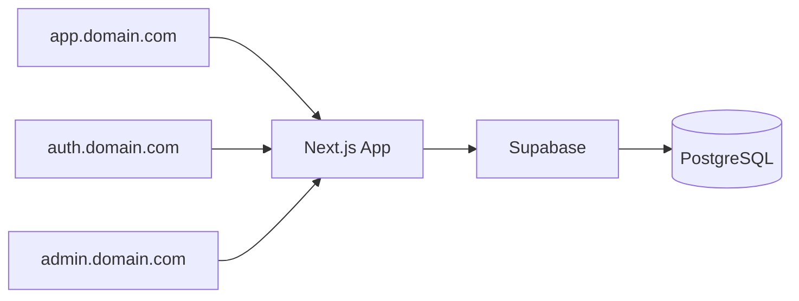
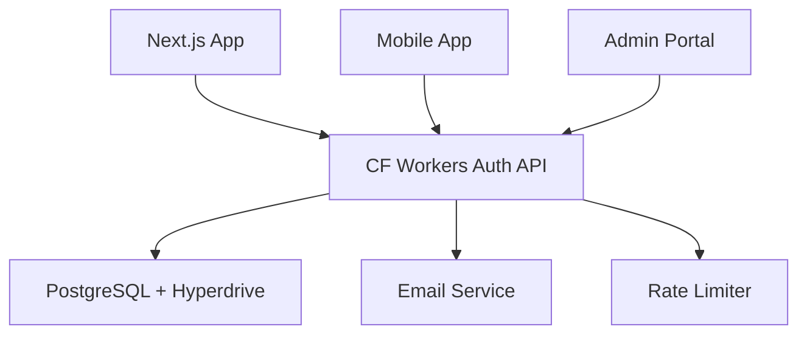

import { Cards, Card } from "fumadocs-ui/components/card";
import { Tabs, Tab } from "fumadocs-ui/components/tabs";
import { Callout } from "fumadocs-ui/components/callout";

<Callout title="What are Snippets?" type="info">
  Snippets are complete, production-ready authentication implementations that
  you can install with a single command. Each snippet includes all necessary
  files, configurations, and best practices.
</Callout>

## Available Snippets

### 🌐 Subdomain Cookie Authentication

Enable authentication across multiple subdomains with shared cookie sessions. Perfect for SaaS applications with separate subdomains for different features.

<Card
  href="/docs/snippets/subdomain-cookies/installation"
  title="Next.js + Supabase Subdomain Cookies"
  description="Share authentication across app.domain.com, auth.domain.com, and more"
/>

**Key Features:**

- Cross-subdomain SSO (Single Sign-On)
- Secure cookie configuration
- Next.js App Router optimized
- Magic link authentication
- TypeScript support

**Use Cases:**

- Multi-tenant SaaS applications
- Separate admin/user portals
- Microservice architectures

---

### ⚡ Edge Authentication API

Build a globally distributed authentication API with Cloudflare Workers and Better Auth. Deploy authentication at the edge for sub-50ms latency worldwide.

<Cards>
  <Card
    href="/docs/snippets/cloudflare-better-auth/installation"
    title="Hono + Cloudflare Workers Server"
    description="Authentication API with Better Auth on Cloudflare's edge network"
  />
  <Card
    href="/docs/snippets/cloudflare-better-auth/client/nextjs"
    title="Next.js Client Integration"
    description="Connect your Next.js app to the Cloudflare Workers auth API"
  />
</Cards>

**Key Features:**

- Global edge deployment
- PostgreSQL with Hyperdrive pooling
- Built-in rate limiting
- CAPTCHA protection
- Email verification
- Admin roles
- 90-day sessions

**Use Cases:**

- Global applications
- API-first architectures
- Microservices authentication
- Mobile app backends

---

### 🏢 Organization Management (Coming Soon)

<Card
  href="/docs/snippets/organizations/installation"
  title="Multi-Organization Support"
  description="Create and manage organizations with team members and permissions"
/>

**Planned Features:**

- Organization creation and management
- Team member invitations
- Role-based permissions
- Organization switching
- Billing integration ready

---

## Comparison Guide

<Tabs items={["Architecture", "Features", "Use Cases"]}>
  <Tab value="Architecture">
    | Feature | Subdomain Cookies | Cloudflare Workers |
    |---------|-------------------|-------------------|
    | **Stack** | Next.js + Supabase | Hono + Better Auth + PostgreSQL |
    | **Deployment** | Vercel/Netlify/Self-host | Cloudflare Workers (Edge) |
    | **Database** | Supabase (PostgreSQL) | Any PostgreSQL + Hyperdrive |
    | **Session Storage** | Cookies + Database | Cookies + Database |
    | **Architecture** | Monolithic | Microservices/API-first |
    | **Latency** | Regional | Global (`<50ms`) |
  </Tab>

{" "}

<Tab value="Features">
  | Feature | Subdomain Cookies | Cloudflare Workers |
  |---------|-------------------|-------------------| | **Email/Password** | ✅
  Via Supabase | ✅ Built-in | | **Magic Links** | ✅ Built-in | ✅ Configurable
  | | **OAuth Providers** | ✅ Via Supabase | ✅ Extensible | | **Email
  Verification** | ✅ | ✅ | | **Password Reset** | ✅ | ✅ | | **Rate
  Limiting** | ✅ Via Supabase | ✅ Native CF | | **CAPTCHA** | ❌ | ✅
  Turnstile | | **Admin Roles** | ✅ | ✅ | | **2FA** | ✅ Via Supabase | 🔄
  Coming soon | | **Webhooks** | ✅ | 🔄 Coming soon |
</Tab>

  <Tab value="Use Cases">
    | Scenario | Recommended Snippet | Why? |
    |----------|-------------------|------|
    | **SaaS with subdomains** | Subdomain Cookies | Native subdomain support |
    | **Global application** | Cloudflare Workers | Edge deployment |
    | **API-first architecture** | Cloudflare Workers | Separate auth service |
    | **Next.js monolith** | Subdomain Cookies | Simpler integration |
    | **Mobile app backend** | Cloudflare Workers | API-focused design |
    | **Enterprise features** | Either | Both support advanced features |
    | **Quick prototype** | Subdomain Cookies | Faster setup with Supabase |
    | **High performance** | Cloudflare Workers | Global edge network |
  </Tab>
</Tabs>

## Quick Start

### Prerequisites

All snippets require:

- Node.js 18+ and npm/pnpm/yarn/bun
- A PostgreSQL database (Supabase, Neon, Railway, etc.)
- Basic knowledge of TypeScript and React

### Installation

All snippets follow the same installation pattern:

```bash
npx shadcn@latest add [snippet-url]
```

For example:

```bash
# Subdomain Cookies
npx shadcn@latest add https://snippets.thedevdavid.com/r/next-supabase-subdomain-cookies.json

# Cloudflare Workers Server
npx shadcn@latest add https://snippets.thedevdavid.com/r/hono-cloudflare-better-auth-server.json

# Next.js Client
npx shadcn@latest add https://snippets.thedevdavid.com/r/hono-cloudflare-better-auth-client-nextjs.json
```

## Architecture Patterns

### Pattern 1: Monolithic with Subdomains



**Best for:**

- Traditional SaaS applications
- Teams familiar with Next.js
- Rapid development

### Pattern 2: Edge Authentication Service



**Best for:**

- Microservices architecture
- Multiple client applications
- Global scale requirements

## Best Practices

### Security

1. **Environment Variables**: Never commit secrets to version control
2. **HTTPS Only**: Always use HTTPS in production
3. **Email Verification**: Enable for production applications
4. **Rate Limiting**: Protect against brute force attacks
5. **Session Management**: Use appropriate session durations
6. **CORS Configuration**: Restrict to known origins

### Performance

1. **Edge Deployment**: Use Cloudflare Workers for global apps
2. **Database Pooling**: Use Hyperdrive or similar for connections
3. **Cookie Caching**: Enable session caching for performance
4. **Static Generation**: Use where possible with auth

### Development Workflow

1. **Local Development**: Use `.env.local` for secrets
2. **Type Safety**: Generate types from your database
3. **Testing**: Test auth flows in development
4. **Monitoring**: Add logging and analytics

## Community

- **GitHub Issues**: Report bugs or request features
- **Discussions**: Share your implementations
- **Contributing**: PRs welcome for new snippets

## What's Next?

<Cards>
  <Card
    title="Explore Subdomain Cookies"
    href="/docs/snippets/subdomain-cookies/installation"
    description="Start with cross-subdomain authentication"
  />
  <Card
    title="Try Edge Authentication"
    href="/docs/snippets/cloudflare-better-auth/installation"
    description="Build a global auth API"
  />
  <Card
    title="View Examples"
    href="https://github.com/thedevdavid/snippets/examples"
    description="See complete implementations"
  />
</Cards>

<Callout type="success" title="Ready to Start?">
  Choose a snippet that matches your architecture and install it with a single
  command. Each snippet includes comprehensive documentation and examples to get
  you started quickly.
</Callout>
