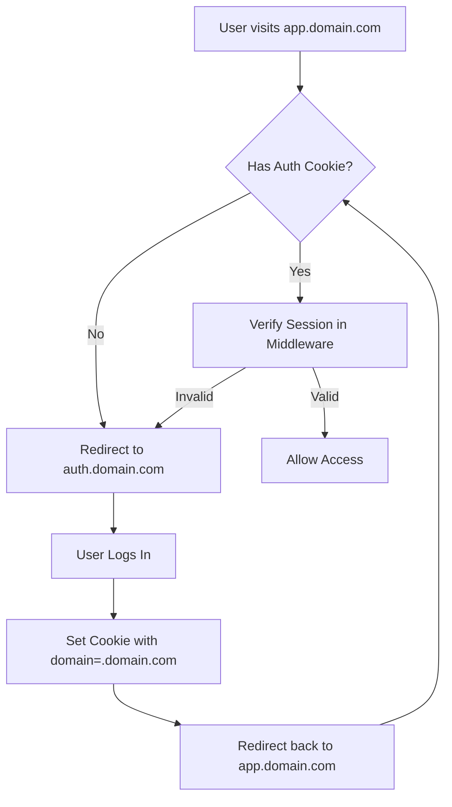

import { Tabs, Tab } from "fumadocs-ui/components/tabs";
import { Steps, Step } from "fumadocs-ui/components/steps";
import { Callout } from "fumadocs-ui/components/callout";
import { CodeBlock } from "fumadocs-ui/components/codeblock";

## Overview

This guide covers Next.js specific implementation details for the subdomain cookie authentication snippet. Learn how to leverage Next.js App Router features for optimal authentication flow across subdomains.

## Architecture

### How It Works



### Key Components

1. **Middleware** - Intercepts all requests to verify and refresh sessions
2. **Server Utilities** - Create Supabase clients with proper cookie handling
3. **Client Utilities** - Browser-side Supabase client for real-time features
4. **Auth Config** - Centralized cookie configuration for subdomain sharing

## Implementation Details

### Middleware Deep Dive

The middleware performs several critical functions:

```ts title="Understanding the Middleware Flow"
// 1. Create Supabase client with cookie access
const supabase = createServerClient(url, anonKey, {
  cookieOptions: COOKIE_OPTIONS,
  cookies: {
    getAll() {
      // Read all cookies from the request
      return request.cookies.getAll();
    },
    setAll(cookiesToSet) {
      // Update cookies in both request and response
      cookiesToSet.forEach(({ name, value, options }) => {
        request.cookies.set(name, value);
        supabaseResponse.cookies.set(name, value, options);
      });
    },
  },
});

// 2. Refresh the user session
const {
  data: { user },
} = await supabase.auth.getUser();

// 3. Handle unauthenticated users
if (!user && protectedRoute) {
  return NextResponse.redirect(new URL("/login", request.url));
}
```

<Callout type="warning">
  Never modify the response between `createServerClient` and `auth.getUser()`.
  This can cause session synchronization issues.
</Callout>

### Server Components vs Client Components

<Tabs items={["Server Components", "Client Components", "Server Actions"]}>
  <Tab value="Server Components">
    ```tsx title="app/dashboard/metrics/page.tsx"
    import { createClient } from "@/utils/supabase/server";
    import { cookies } from "next/headers";

    export default async function MetricsPage() {
      const supabase = await createClient();

      // Fetch user data
      const { data: { user } } = await supabase.auth.getUser();

      // Fetch user-specific data
      const { data: metrics } = await supabase
        .from("metrics")
        .select("*")
        .eq("user_id", user.id)
        .order("created_at", { ascending: false });

      return (
        <div>
          <h1>Welcome {user.email}</h1>
          <MetricsList metrics={metrics} />
        </div>
      );
    }
    ```

  </Tab>

  <Tab value="Client Components">
    ```tsx title="components/realtime-notifications.tsx"
    "use client";

    import { createClient } from "@/utils/supabase/client";
    import { useEffect, useState } from "react";

    export function RealtimeNotifications({ userId }: { userId: string }) {
      const [notifications, setNotifications] = useState([]);
      const supabase = createClient();

      useEffect(() => {
        // Set up realtime subscription
        const channel = supabase
          .channel("notifications")
          .on(
            "postgres_changes",
            {
              event: "INSERT",
              schema: "public",
              table: "notifications",
              filter: `user_id=eq.${userId}`,
            },
            (payload) => {
              setNotifications(prev => [payload.new, ...prev]);
            }
          )
          .subscribe();

        return () => {
          supabase.removeChannel(channel);
        };
      }, [userId]);

      return (
        <div>
          {notifications.map(notif => (
            <NotificationItem key={notif.id} {...notif} />
          ))}
        </div>
      );
    }
    ```

  </Tab>

  <Tab value="Server Actions">
    ```tsx title="app/settings/actions.ts"
    "use server";

    import { createClient } from "@/utils/supabase/server";
    import { revalidatePath } from "next/cache";
    import { redirect } from "next/navigation";

    export async function updateUserSettings(formData: FormData) {
      const supabase = await createClient();

      // Get current user
      const { data: { user } } = await supabase.auth.getUser();

      if (!user) {
        redirect("/login");
      }

      // Update settings
      const { error } = await supabase
        .from("user_settings")
        .upsert({
          user_id: user.id,
          theme: formData.get("theme"),
          notifications: formData.get("notifications") === "on",
          language: formData.get("language"),
        });

      if (error) {
        return { error: error.message };
      }

      revalidatePath("/settings");
      return { success: true };
    }
    ```

  </Tab>
</Tabs>

## Advanced Patterns

### Dynamic Subdomain Routing

Handle dynamic subdomains for multi-tenant applications:

```ts title="middleware.ts"
import { updateSession } from "@/utils/supabase/middleware";
import type { NextRequest } from "next/server";

export async function middleware(request: NextRequest) {
  // Extract subdomain
  const hostname = request.headers.get("host") || "";
  const subdomain = hostname.split(".")[0];

  // Handle tenant-specific logic
  if (subdomain && subdomain !== "www" && subdomain !== "app") {
    // Store tenant info in headers for downstream use
    request.headers.set("x-tenant", subdomain);
  }

  // Continue with session update
  return await updateSession(request);
}
```

### Parallel Data Fetching

Optimize performance with parallel queries:

```tsx title="app/dashboard/page.tsx"
import { createClient } from "@/utils/supabase/server";

export default async function Dashboard() {
  const supabase = await createClient();

  // Parallel data fetching
  const [
    {
      data: { user },
    },
    { data: profile },
    { data: projects },
    { data: activities },
  ] = await Promise.all([
    supabase.auth.getUser(),
    supabase.from("profiles").select("*").single(),
    supabase.from("projects").select("*").limit(10),
    supabase.from("activities").select("*").limit(20),
  ]);

  return <DashboardLayout {...{ user, profile, projects, activities }} />;
}
```

### Custom Hooks for Auth State

Create reusable hooks for client-side auth:

```tsx title="hooks/use-auth.ts"
"use client";

import { createClient } from "@/utils/supabase/client";
import { useRouter } from "next/navigation";
import { useEffect, useState } from "react";
import type { User } from "@supabase/supabase-js";

export function useAuth() {
  const [user, setUser] = useState<User | null>(null);
  const [loading, setLoading] = useState(true);
  const router = useRouter();
  const supabase = createClient();

  useEffect(() => {
    // Get initial session
    supabase.auth.getUser().then(({ data: { user } }) => {
      setUser(user);
      setLoading(false);
    });

    // Listen for auth changes
    const {
      data: { subscription },
    } = supabase.auth.onAuthStateChange((event, session) => {
      setUser(session?.user ?? null);

      if (event === "SIGNED_OUT") {
        router.push("/login");
      }
    });

    return () => subscription.unsubscribe();
  }, []);

  return { user, loading };
}
```

## Performance Optimization

### 1. Static Generation with Auth

Use `generateStaticParams` for authenticated static pages:

```tsx title="app/docs/[slug]/page.tsx"
import { createClient } from "@/utils/supabase/server";

export async function generateStaticParams() {
  const supabase = await createClient();

  const { data: docs } = await supabase
    .from("documentation")
    .select("slug")
    .eq("is_public", true);

  return (
    docs?.map((doc) => ({
      slug: doc.slug,
    })) || []
  );
}
```

### 2. Edge Runtime Compatibility

Make middleware Edge-compatible:

```ts title="middleware.ts"
export const config = {
  runtime: "edge",
  matcher: ["/((?!_next/static|_next/image|favicon.ico).*)"],
};
```

### 3. Prefetching Strategies

Implement smart prefetching:

```tsx title="components/navigation.tsx"
"use client";

import Link from "next/link";
import { useRouter } from "next/navigation";

export function Navigation() {
  const router = useRouter();

  // Prefetch on hover
  const handleMouseEnter = (href: string) => {
    router.prefetch(href);
  };

  return (
    <nav>
      <Link
        href="/dashboard"
        onMouseEnter={() => handleMouseEnter("/dashboard")}
      >
        Dashboard
      </Link>
    </nav>
  );
}
```

## Deployment Considerations

### Environment Variables

Set up environment-specific configurations:

<Tabs items={["Vercel", "Netlify", "Self-hosted"]}>
  <Tab value="Vercel">
    ```bash
    # Production
    NEXT_PUBLIC_SUPABASE_URL=https://your-project.supabase.co
    NEXT_PUBLIC_SUPABASE_ANON_KEY=your-anon-key
    COOKIE_DOMAIN=.yourdomain.com

    # Preview
    COOKIE_DOMAIN=.vercel.app
    ```

  </Tab>

  <Tab value="Netlify">
    ```toml title="netlify.toml"
    [build.environment]
      NEXT_PUBLIC_SUPABASE_URL = "https://your-project.supabase.co"
      NEXT_PUBLIC_SUPABASE_ANON_KEY = "your-anon-key"

    [context.production.environment]
      COOKIE_DOMAIN = ".yourdomain.com"

    [context.deploy-preview.environment]
      COOKIE_DOMAIN = ".netlify.app"
    ```

  </Tab>

  <Tab value="Self-hosted">
    ```dockerfile
    # Dockerfile
    ENV NEXT_PUBLIC_SUPABASE_URL=https://your-project.supabase.co
    ENV NEXT_PUBLIC_SUPABASE_ANON_KEY=your-anon-key
    ENV COOKIE_DOMAIN=.yourdomain.com
    ```
  </Tab>
</Tabs>

### Security Headers

Add security headers for production:

```ts title="next.config.ts"
const securityHeaders = [
  {
    key: "X-DNS-Prefetch-Control",
    value: "on",
  },
  {
    key: "Strict-Transport-Security",
    value: "max-age=63072000; includeSubDomains; preload",
  },
  {
    key: "X-Content-Type-Options",
    value: "nosniff",
  },
];

export default {
  async headers() {
    return [
      {
        source: "/:path*",
        headers: securityHeaders,
      },
    ];
  },
};
```

## Troubleshooting

### Common Issues

<Steps>
  <Step>
    ### Cookie Not Set After Login

    Check your auth callback URL configuration in Supabase:
    - Should include all subdomains: `https://*.yourdomain.com/**`
    - For development: `http://*.localhost:3000/**`

  </Step>

  <Step>
    ### Session Lost on Navigation

    Ensure middleware is properly configured:
    ```ts
    export const config = {
      matcher: [
        "/((?!_next/static|_next/image|favicon.ico|.*\\.(?:svg|png|jpg|jpeg|gif|webp)$).*)",
      ],
    };
    ```

  </Step>

  <Step>
    ### TypeScript Errors with Supabase Types

    Generate types from your Supabase project:
    ```bash
    npx supabase gen types typescript --project-id your-project-id > types/supabase.ts
    ```

  </Step>
</Steps>

## Best Practices

1. **Always use Server Components for initial auth checks**
2. **Implement proper error boundaries around auth-dependent components**
3. **Use Suspense for loading states in authenticated routes**
4. **Cache user data appropriately with Next.js caching**
5. **Monitor auth-related errors with proper logging**

## Next Steps

- Explore [Supabase configuration](/docs/snippets/subdomain-cookies/supabase) for database setup
- Learn about [advanced patterns](/docs/snippets/subdomain-cookies/advanced) for complex use cases
- Check out the [Better Auth snippet](/docs/snippets/cloudflare-better-auth) for an alternative approach
